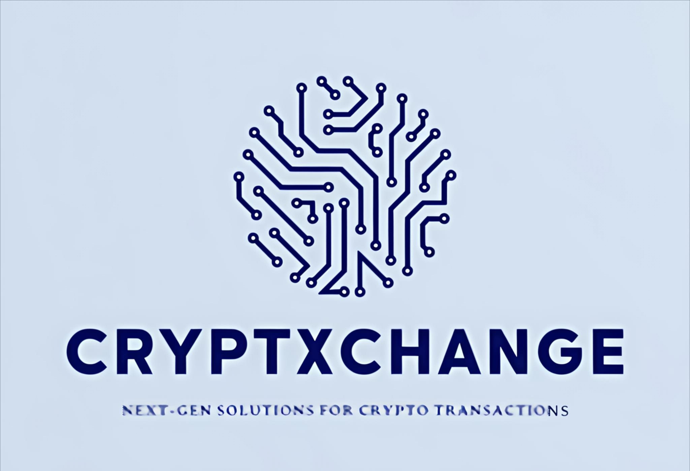

# CryptXchange  

**Where Interactivity Meets Security in the Crypto Universe**  

  

  

CryptXchange is a **holistic cryptocurrency platform** combining multi-layered security, AI-driven insights, and educational tools to empower users to navigate the blockchain space confidently. Swap, track, and learn about crypto with enterprise-grade protection and real-time analytics.  

## The Challenge  
Cryptocurrency adoption is hindered by:  
- 🔐 **Security Risks**: Rising fraud, hacking, and unauthorized access.  
- 📉 **Financial Illiteracy**: Lack of accessible crypto education for beginners.  
- 📊 **Opaque Tracking**: Limited tools to monitor spending patterns and portfolio health.  
- 🤖 **Complex Interfaces**: Steep learning curves deter mainstream adoption.  

## Our Solution  
A **secure, user-centric ecosystem** offering:  
- 🔄 **Instant Swaps**: Seamlessly swap, buy, or sell 100+ cryptocurrencies.  
- 🛡️ **AI-Powered Security**: Real-time fraud detection using TensorFlow ML models.  
- 📈 **Expense Analytics**: Track spending habits and portfolio performance.  
- 🧑🏫 **Crypto Academy**: Learn market strategies, tokenomics, and trends.  
- 🤖 **Chatbot Companion**: 24/7 support for transactions and queries.  
- 👁️ **Biometric Verification**: AI-driven facial/fingerprint authentication.  

## Key Features  
| Category              | Features                                                                                   |
|-----------------------|-------------------------------------------------------------------------------------------|
| **Security**          | Blockchain anomaly detection, biometric logins, end-to-end encryption                     |
| **Transactions**      | Multi-chain swaps, gas fee optimization, real-time price alerts                          |
| **Education**         | Video courses, market simulations, daily trend reports                                   |
| **Analytics**         | Spending heatmaps, tax-ready reports, risk assessment tools                              |
| **Support**           | Voiceflow chatbot, community forums, API documentation                                   |

## Technology Stack  
- **Frontend**: React.js, Redux, Web3.js, HTML/CSS  
- **Backend**: Node.js, Express.js, Python  
- **Blockchain**: Solidity smart contracts, Ethereum, ERC-20/ERC-721 standards  
- **AI/ML**: TensorFlow (threat detection), Voiceflow (chatbot)  
- **Database**: MongoDB (NoSQL), IPFS (decentralized storage)  
- **Auth**: Biometric AI models, JWT tokenization  

## Unique Selling Points  
- 🛡️ **Multi-Layered Security**: Combats fraud with AI + blockchain analytics.  
- 📊 **Financial Mindfulness**: Real-time expense tracking and tax tools.  
- 🎓 **Learn-to-Earn**: Complete courses to earn crypto rewards.  
- 🤝 **Community-Driven**: Collaborative forums and expert AMA sessions.  

## Product Status  
✅ **60% Completed**  
- Core features built: Swap engine, biometric auth, chatbot, basic dashboard.  
- Next phases: Testing threat detection models, expanding educational content.  

## Business Model  
- **Revenue Streams**:  
  - Transaction fees (0.25% per swap)  
  - Premium subscriptions for advanced analytics  
  - Certification programs in Crypto Academy  
  - B2B API licensing for enterprises  
- **Cost Structure**:  
  - 30% development (AI/blockchain R&D)  
  - 25% marketing (community growth campaigns)  
  - 20% operations (server/maintenance costs)  

## Team  
**DEFI FORGE**  
- Sagar Teotia (Blockchain Architect)  
- Abhinav Mishra (AI/ML Engineer)  
- Aditya Bhattacharya (Frontend Lead)  
- Akshat Gupta (Backend Developer)  
- Shikar Jopher (Security Analyst)  

**Join the revolution where crypto meets clarity—trade smarter, learn faster, and secure your future.**  

Made with ❤️ for a decentralized tomorrow.  
